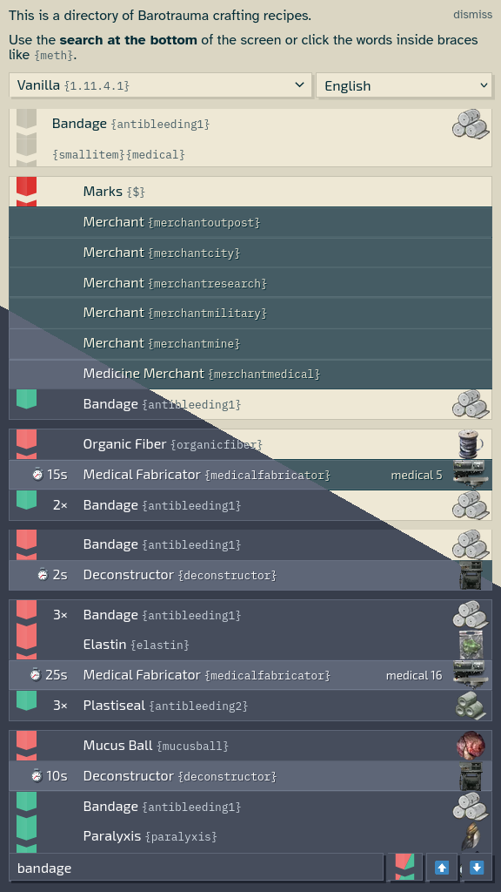
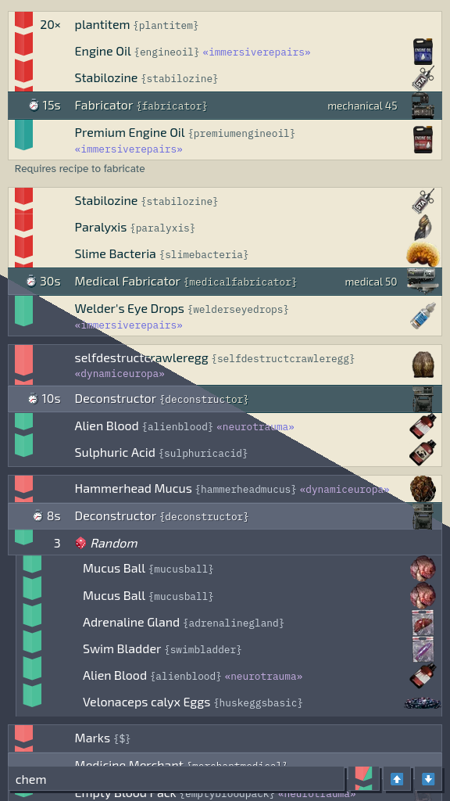
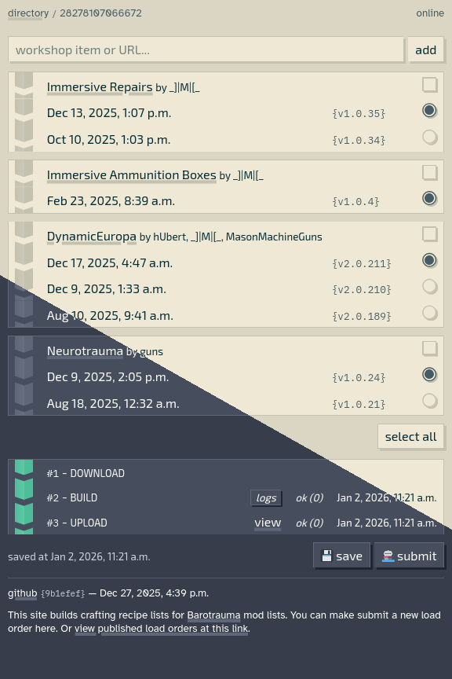

# Europan Materialist

Search a list of crafting recipes for the game [Barotrauma](https://barotraumagame.com/).

View it at [materialist.pages.dev](https://materialist.pages.dev/).

Submit your mod load order at [materialist-splicer.pages.dev](https://materialist-splicer.pages.dev/b/).

- Lists fabrication recipes, deconstruction recipes, and whether merchants and vending machines sell a particular item.

- Filter recipes and items by game identifier. Optionally, match that identifier only in recipes either as an item consumed or an item produced by the recipe.

- Localization support using game provided localization files. 

- Light mode. Dank mode.

- New in 2026; added a service that builds a recipe list from mods that you can submit. Go to [materialist-splicer.pages.dev](https://materialist-splicer.pages.dev/b/), and add steam ids or URLs to workshop items or collections.

You can contact me by email or posting in [this thread in the Undertow Games "server" on discord.com](https://discord.com/channels/103209684680323072/1148994576237990012/threads/1456771788368511129).

