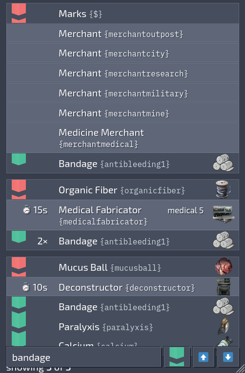

# Europan Materialist

Search a list of crafting recipes for the game [Barotrauma](https://barotraumagame.com/).

View it at [materialist.pages.dev](https://materialist.pages.dev/).

- Lists fabrication recipes, deconstruction recipes, and whether merchants and vending machines sell a particular item.

- Filter recipes and items by game identifier. Optionally, match that identifier only in recipes either as an item consumed or an item produced by the recipe.

- Localization support using game provided localization files. 

- Mod support. The public website (linked above) currently has the option to list items and recipes from [Enhanced Reactors](https://steamcommunity.com/sharedfiles/filedetails/?id=3045796581c) and [Neurotrauma](https://steamcommunity.com/sharedfiles/filedetails/?id=2776270649). (The build script supports mods generally and whatever load order you specify. Those two are just the ones featured on the public website. Contact me if you want more added.)

You can contact me by email or posting in [this thread in the Undertow Games "server" on discord.com](https://discord.com/channels/103209684680323072/1175138409954672641).

<picture>
  <source srcset="misc/screenshot-bandage.png 1.25x" />
  
</picture>

<picture>
    <source srcset="misc/screenshot-healthscanner.png 1.25x" />
    
</picture>

## building it yourself

The web UI is a JavaScript heavy page built on SolidJS. But it's possible to serve it just as static files; no application server is necessary.
It uses generated data from the game's files using the Python script `baro-data.py`.

To generate that data, you need a copy of Barotrauma (or just its Content directory). The dedicated server files do not include art assets, so using them is not supported.

- `baro-data.py` is used to read the data in Barotrauma's Content directory (or from mods) and write output to `web/assets/bundles`.
- Then, in the `web` directory, running `npm x -- vite build` should build the static files using the information written by `baro-data.py`. Those static files are written to `web/dist`.
- `web/dist` should be all the files a webserver needs to serve a working version of the website. (`web/assets/bundles` is only needed by `vite`, not for serving static files after `vite build`.)  

There is a `Containerfile` that you can run with podman or docker to do most of this for you. It expects the vanilla content directory to be mounted at `/Content`. By default, it writes static assets to `/build/web/dist` in the image.

The Containerfile has multiple stages (targets). I don't recommend it, but you _could_ build up to the `webinstall` target and run that image to run `vite` inside the container and serve the thing directly with vite that way.

    $ podman build -f Containerfile \
       -v /your/path/to/Barotrauma/Content:/Content:ro \
       --tag barowebinstall \
       --target webinstall
    $ podman run --rm -it -p 8011:8011 barowebinstall

But you probably should just run `podman build` with `-v /path/to/output/on/host:/build/web/dist` and serve it with [nginx](https://hub.docker.com/_/nginx) or [caddy](https://hub.docker.com/_/caddy) or some other webserver. Or make an target `FROM` one of those webservers and `COPY --from=webinstall /build/web/dist ...` or something idk.

## building with mods

Building the site with mod data requires they be mounted into the namespace, along with the vanilla Content, and specified as arguments to `baro-data.py`. To do this, the `Containerfile` runs `baro-data.py` using the arguments in the `DATAGEN_ARGS` build argument which can be set by passing `--build-arg DATAGEN_ARGS=...` to `podman build`.

`baro-data.py` has two arguments that we care about: `--content`, used to specify paths to Vanilla content or mods; `--package`, to specify what load orders to use. `--package` can be specified multiple times to build with different load orders which are then selectable in the web UI.

For the public website linked at the beginning of this document, I used the `steamcmd` container image to download "Enhanced Reactors" and "Neurotrauma" respectively.

    podman run -it \
      -v ~/Barotrauma-mods:/Barotrauma steamcmd/steamcmd:latest \
      +force_install_dir /Barotrauma \
      +login anonymous \
      +workshop_download_item 602960 2776270649 \
      +workshop_download_item 602960 3045796581 \
      +quit

We can build the image with something like:

    podman build -f Containerfile \
      -v ~/Barotrauma-mods/steamapps/workshop/content/602960:/Mods:ro \
      --build-arg DATAGEN_ARGS="\
        --content /Content /Mods/2776270649 /Mods/3045796581 \
        --package Vanilla \
        --package Vanilla 'Enhanced Reactors' Neurotrauma"

Since `--package` is listed twice, the web UI has two load order options. The first `--package` listed in the arguments is used as the default.

*protip:* You can use `podman build` without a checkout/working tree of the git repository, `git archive master | podman build -f -` or download the zip from GitHub.
